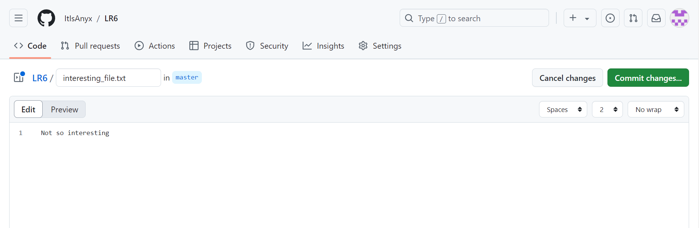
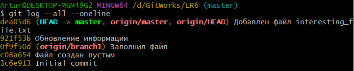
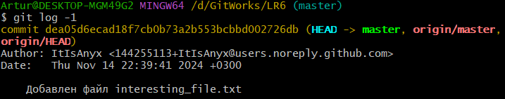
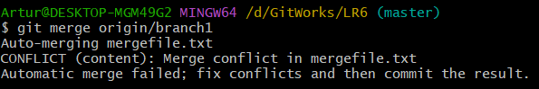
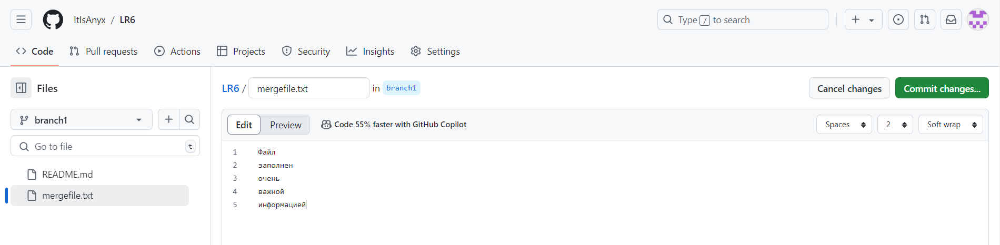

# LR6
Лабораторная работа №6

# Отчёт по лабораторной работе №6
## 1. Клонирование репозитория
Для клонирования репозитория необходимо сделать форк, не забыв убрать галочку с пункта "Copy the `master` branch only"

После в git bash необходимо перейти в папку, где будет создан локальный репозиторий и выполнить следующую команду:

`$ git clone https://github.com/ItIsAnyx/LR6`

## 2. Добавление нового файла

*Скриншот с добавлением нового файла*

## 3. Добавление изменений в локальный репозиторий

`$ git pull`

## 4. Получение истории операций для каждой из веток

`$ git log --all --oneline`

*Скриншот полученной информации из консоли*

## 5. Просмотр последних изменений

`$ git log -1`

*Скриншот полученной информации из консоли*

## 6. Слияние веток и решение конфликта
Для слияния веток необходимо использовать следующую команду:

`$ git merge origin/branch1`

Однако у нас появляется конфликт, который не позволяет в данный момент выполнить слияние:

*Скриншот конфликта*

Для его решения меняем содержимое файла в ветке branch1

*Скриншот изменения файла mergefile.txt*

После чего снова выполняем команду

`$ git merge origin/branch1`

## 7. Удаление побочной ветки

`$ git branch -d branch1`

## 8. Откат коммита

`$ git reset --hard cbbed4b`

Для обновления удалённого репозитория к `git push` необходимо добавить флаг `--force`

`$ git push --force`

## 9. Создание побочной ветки

`$ git checkout -b report`

Отправляем изменения, привязывая новую ветку к удалённому репозиторию

`$ git push -u origin report`

## 10. Получение истории операций в форматированном виде

`$ git log --pretty=format:"%h %ad %an %s" --date=short`

**История операций:**
* 73c92f5 2024-11-15 ItIsAnyx Исправление мелких недочётов README.md
* 7c339dd 2024-11-15 ItIsAnyx Финальные штрихи в README.md
* 6f750fd 2024-11-15 ItIsAnyx Обновление README.md
* b520b0c 2024-11-15 ItIsAnyx Изменение README.md
* e3ec787 2024-11-15 ItIsAnyx Добавление изображений в README.md
* 8808f5d 2024-11-15 ItIsAnyx Изменение README.md
* 60f04af 2024-11-15 ItIsAnyx Изменены названия изображений
* ffab324 2024-11-15 ItIsAnyx Добавлены скрины для отчёта
* c2ceecd 2024-11-15 ItIsAnyx Обновление README.md
* 3b80524 2024-11-15 ItIsAnyx Обновление README.md
* 1145103 2024-11-15 ItIsAnyx Добавление отчёта в README.md
* cbbed4b 2024-11-15 ItIsAnyx Изменён interesting_file.txt
* 0bdfb6d 2024-11-15 ItIsAnyx Попытка слияния веток
* 0553bcf 2024-11-14 ItIsAnyx Создан файл interesting_file.txt
* ee0910b 2024-11-14 ItIsAnyx Обновлён mergefile.txt
* 0f9f50d 2020-11-21 Kurtyanik Заполнил файл
* c08a654 2020-11-21 Kurtyanik Файл создан пустым
* 3c6e913 2020-11-21 Kurtyanik Initial commit
